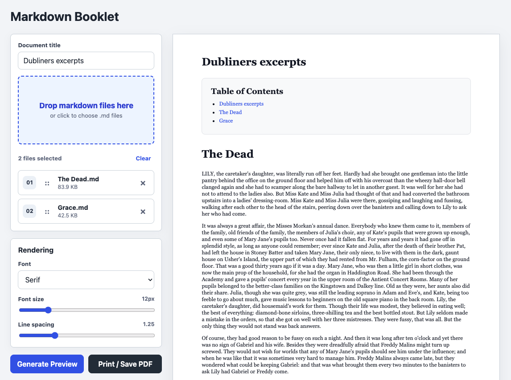

# Markdown Booklet

Combine multiple markdown files, reorder them, and render a single print-ready document or PDF — entirely in your browser. Nothing is uploaded anywhere.



## Features

- Drag-and-drop or click to load `.md` files
- Drag to reorder files before generating
- Auto-generated table of contents
- Mermaid diagram support
- Font, size, and line-spacing controls
- Print or export to PDF via your browser's native print dialog

## Use it

**Online:** [colincarrihill.github.io/markdown-booklet](https://colincarrihill.github.io/markdown-booklet)

**Locally — for sensitive documents:**

```bash
git clone https://github.com/colincarrihill/markdown-booklet
open index.html
```

No install, no server, no build step. Just open the file.

## Stack

Single `index.html`. No backend.

- [markdown-it](https://github.com/markdown-it/markdown-it) — markdown rendering
- [Mermaid](https://mermaid.js.org) — diagram support
- [SortableJS](https://sortablejs.github.io/Sortable/) — drag-to-reorder
